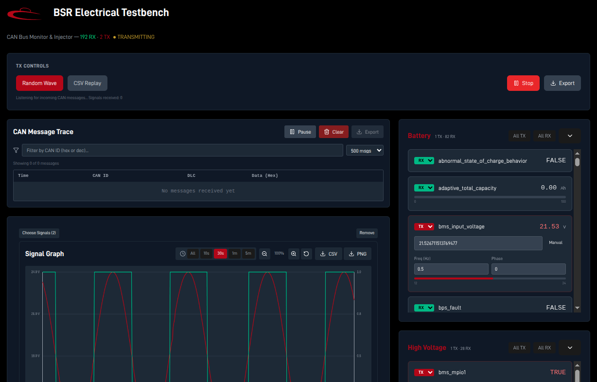

# Solar Car 2 Electrical Testbench

A web-based dashboard for testing and monitoring CAN bus signals in real-time. This system allows you to send and receive CAN messages through an intuitive frontend interface, running on a Raspberry Pi connected to the vehicle's CAN bus.

The dashboard uses a **unified TX/RX architecture** — just like a real CAN node, it transmits and receives simultaneously. Each signal has a per-signal direction dropdown (TX or RX). TX signals can be driven via random wave, CSV replay, or manual input. RX signals display live values from the bus. Any signal (TX or RX) can be plotted on the always-visible graph panel.

**Primary Use Case**: Connect your laptop/desktop to the Raspberry Pi over Tailscale, run the backend on the Pi, and interact with the CAN bus through the web dashboard.

Link to docs: https://www.waveshare.com/wiki/RS485_CAN_HAT#Install_Library

CAN Messages: https://docs.google.com/spreadsheets/d/12O2UPdM_fqUVKd0IXZ638wb1obtBXQp11giv7swfWM4/edit?gid=575020774#gid=575020774

## Features

- **Unified TX/RX Dashboard**: No mode switching — transmit and receive simultaneously, just like a real CAN node
- **Per-Signal Direction**: Each signal has a TX/RX dropdown — TX to inject onto the bus, RX to monitor from the bus
- **TX Generation**: Drive TX signals via Random Wave, CSV Replay, or Manual Override
- **Live Graphing**: Check any signal's plot checkbox (TX or RX) to visualize its value over time
- **Bi-directional WebSocket communication** between frontend and CAN bus
- **BSR Red branding** with D-DIN font
- **180+ signals** from format.json organized by subsystem

## Screenshots

<p align="center">
  
</p>

## Architecture

```
Laptop/Desktop (Browser) <--WebSocket--> Raspberry Pi (Backend) <--CAN--> Vehicle CAN Bus
  ↓ Tailscale VPN ↓
```

## Quick Start (Primary Workflow)

### 1. Setup Raspberry Pi

**On the Raspberry Pi:**

```bash
# Clone the repository
git clone <repo-url>
cd electrical-testbench

# Initialize submodules
git submodule update --init --recursive

# Create and activate virtual environment
python3 -m venv .venv
source .venv/bin/activate

# Install Python dependencies
pip install python-can websockets

# Ensure CAN interface is up (replace can0 with vcan0 for testing)
sudo ip link set can0 up type can bitrate 500000
```

**Configure Tailscale:**

```bash
# Install Tailscale on Pi
curl -fsSL https://tailscale.com/install.sh | sh
sudo tailscale up

# Get Pi's Tailscale IP
tailscale ip -4
# Example output: 100.64.1.5
```

**Start the Backend:**

```bash
python api/main.py
```

The WebSocket server will run on port 8765.

### 2. Setup Your Laptop/Desktop

**Install Tailscale:**

- Download from https://tailscale.com/download
- Login and connect to the same Tailnet as the Pi

**Update Frontend Configuration:**

Edit `frontend/src/App.jsx` and replace `localhost` with your Pi's Tailscale IP:

```javascript
const websocket = new WebSocket(`ws://100.64.1.5:${server}`);
```

**Install and Run Frontend:**

```bash
cd frontend
npm install
npm run dev
```

Open your browser to `http://localhost:5173`

### 3. Use the Dashboard

- By default all signals start as **RX** (passive monitoring)
- Set individual signals (or entire categories) to **TX** to inject values onto the CAN bus
- Choose a TX generation mode: **Random Wave** or **CSV Replay**, then click **Start**
- When TX generation is stopped, TX signals show manual input controls for one-off sends
- Check the **plot** checkbox on any signal to visualize it on the live graph panel

## Project Structure

```
electrical-testbench/
├── api/                           # WebSocket server for CAN communication
│   └── main.py                    # Backend server (runs on Pi)
├── can_utils/                     # CAN utilities
│   ├── data_classes.py           # Signal data structures
│   ├── encode_signal.py          # Signal → CAN encoding
│   ├── read_can_messages.py      # CAN → Signal parsing
│   └── send_messages.py          # Manual CAN message sender
├── frontend/                      # React dashboard
│   ├── src/
│   │   ├── App.jsx               # WebSocket connection manager
│   │   ├── signalConfig.js       # Frontend signal definitions
│   │   └── components/
│   │       ├── Dashboard.jsx     # Main unified dashboard UI
│   │       └── Graph.jsx         # Live signal graph component
│   ├── public/fonts/             # D-DIN fonts
│   └── package.json
├── sc-data-format/              # Signal definitions (submodule)
│   └── format.json               # CAN signal specifications
├── d-din/                        # D-DIN font files
└── README.md
```
## Testing Without CAN Hardware

For development and testing without real CAN hardware:

**Create Virtual CAN Interface:**

```bash
sudo modprobe vcan
sudo ip link add dev vcan0 type vcan
sudo ip link set up vcan0
```

**Update Backend to Use vcan0:**

In `api/main.py`, change:
```python
bus = can.interface.Bus(channel="vcan0", bustype="socketcan")
```

**Monitor CAN Traffic:**

```bash
candump vcan0
```

**Send Test Messages:**

Use the included utility:
```bash
python can_utils/send_messages.py vcan0
```

Or send directly with Python:
```python
import can, struct
bus = can.interface.Bus(channel='vcan0', bustype='socketcan')
# Send accelerator_pedal = 0.75 (CAN ID 0x200, offset 0)
data = struct.pack('<f', 0.75) + b'\x00'*4
msg = can.Message(arbitration_id=0x200, data=data, is_extended_id=False)
bus.send(msg)
```

## Backup: Individual Python Scripts

If you need to interact with CAN directly without the dashboard:

**Listen to CAN Messages (Console Output):**
```bash
python can_utils/read_can_messages.py
```

**Send CAN Messages Interactively:**
```bash
python can_utils/send_messages.py can0
```

**Mock Data Server (Testing):**
```bash
python mock_messages.py
```

## Troubleshooting

**WebSocket connection fails:**
- Check that backend is running: `python api/main.py`
- Verify Tailscale IPs match in `frontend/src/App.jsx`
- Check firewall: `sudo ufw allow 8765/tcp`

**CAN messages not sending:**
- Verify CAN interface is up: `ip link show can0`
- Check permissions: may need `sudo` for CAN access
- Test with `cansend` or `candump` utilities

**Signals not encoding:**
- Ensure signal name matches exactly in `sc-data-format/format.json`
- Check backend logs for encoding errors

**Numbers showing white instead of green:**
- Backend must be parsing incoming messages correctly
- Check that CAN IDs and offsets in `format.json` match transmitted messages
- Verify WebSocket is receiving parsed data (check browser console)

## Requirements

- **Hardware**: Raspberry Pi with CAN HAT (e.g., Waveshare RS485 CAN HAT)
- **Software**: 
  - Raspberry Pi OS (or Linux with SocketCAN)
  - Python 3.7+
  - Node.js 14+ (for frontend)
  - Tailscale (for remote access)
- **Network**: Tailscale VPN connecting laptop and Pi

## Color Scheme

- **BSR Red** (#A90515): Active buttons, category headers, progress bars (send mode)
- **Green** (#10b981): Received signal values and progress bars (read mode)
- **Black/White**: Background and text
- **Font**: D-DIN
